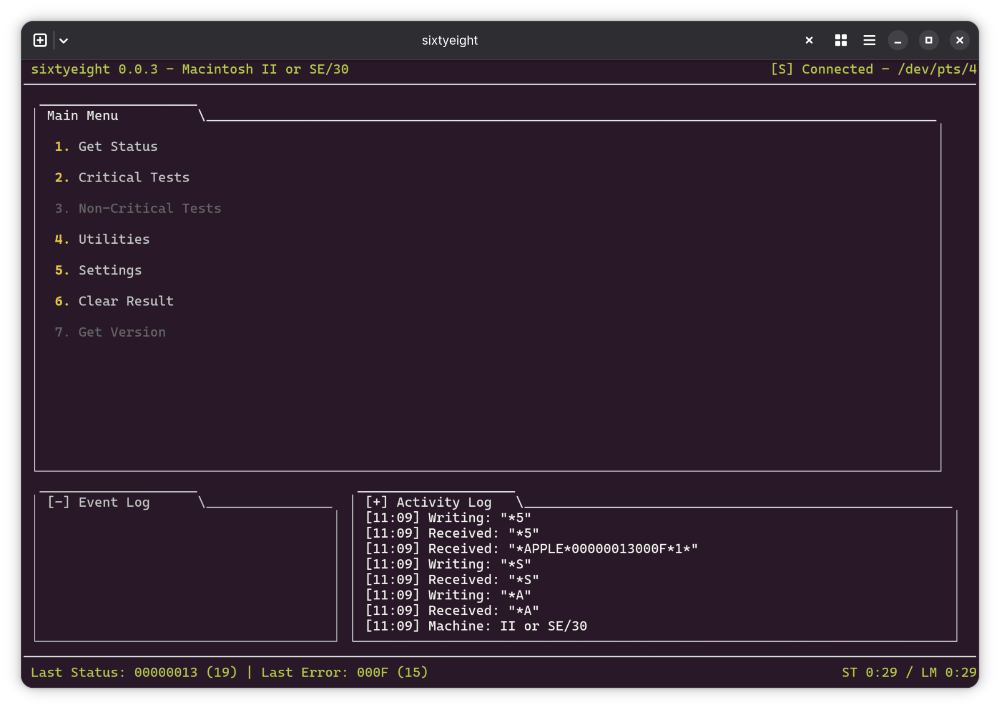

# sixtyeight

A text based user interface to the 68K Macintosh serial diagnostics, as
documented by Rob Braun and Adrian Black.

https://docs.google.com/spreadsheets/d/1zsc7ET5fyiOYWj1_AzOgafbrCVFED-7jzLH6ruCiAVE/edit?usp=sharing

Written in TypeScript, targeting Node 24+.

This is absolutely a work in progress. Some of this doesn't work, some of it is
still untested or not tested on real hardware. There's still more functionality
I'm figuring out how to present.
